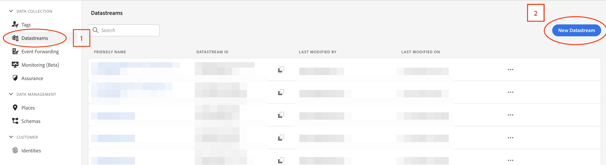
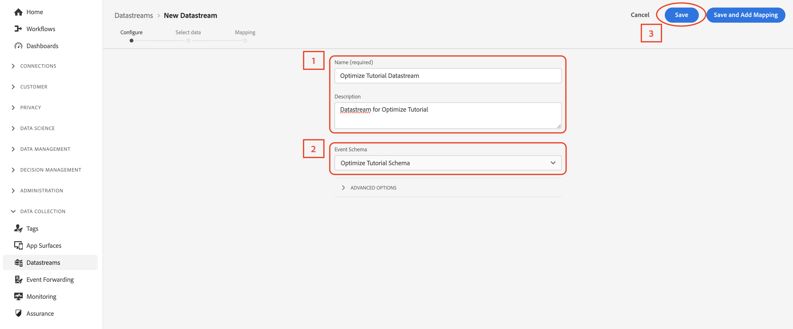
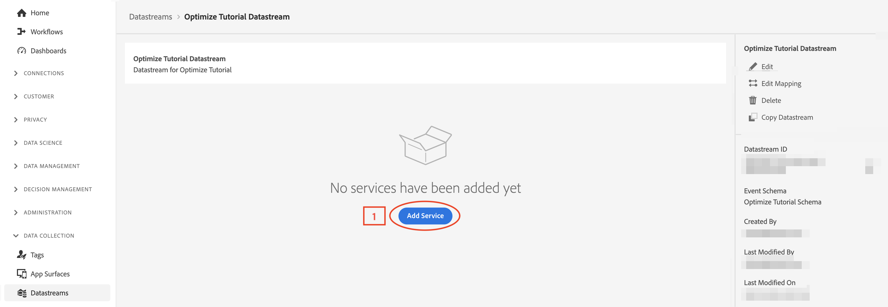
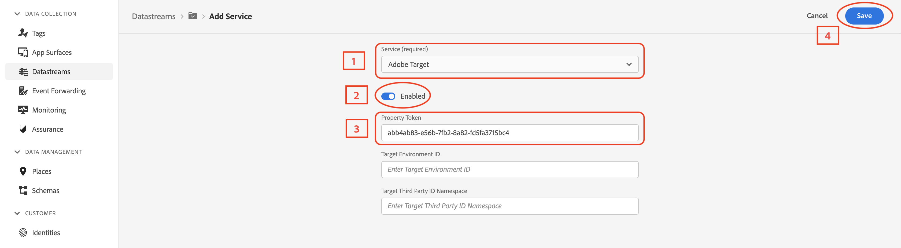

### Create a Datastream

  
 What is a datastream? 

A datastream is a server-side configuration on Platform Edge Network that controls where data goes. Datastreams ensure that incoming data is routed to the Adobe Experience Platform application and services (like Analytics) appropriately. For more information, see the [datastreams documentation](https://experienceleague.adobe.com/docs/experience-platform/edge/datastreams/overview.html?lang=en) or this [video](https://experienceleague.adobe.com/docs/platform-learn/data-collection/edge-network/configure-datastreams.html?lang=en).

In order to send data to the Edge Network, the datastream must be configured with the Event schema.

Select **Datastreams** (**1**) under **DATA COLLECTION** in the left side navigation panel . Select **New Datastream** (**2**) in the top right .

  

Give the datastream an identifying name and description (**1**), then pick the schema created in the previous section using the dropdown menu (**2**). Then select **Save** (**3**).

  

With the datastream set up, data can be directed to its destination by adding services. In this case, Adobe Target:
1. Select **Add Service** (**1**)

  

2. From the **Service (required)** dropdown (**1**), select **Adobe Target**.
3. Select **Save**.

 
