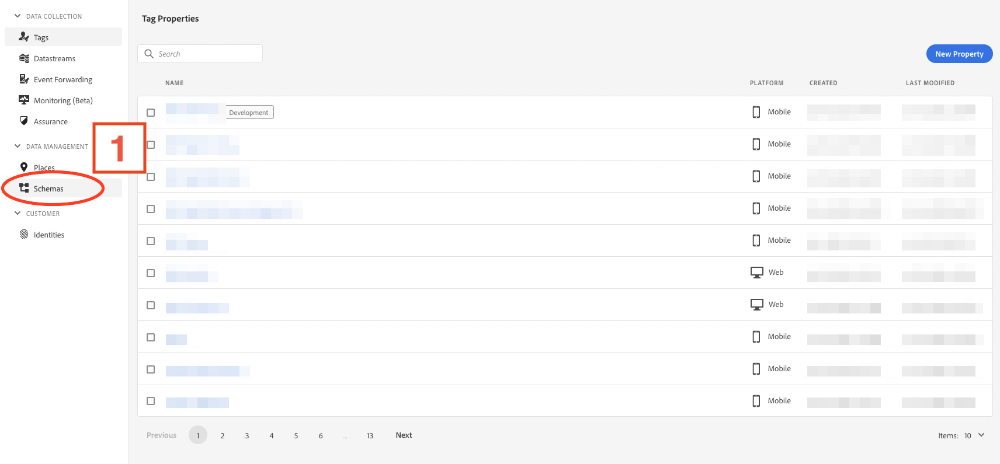
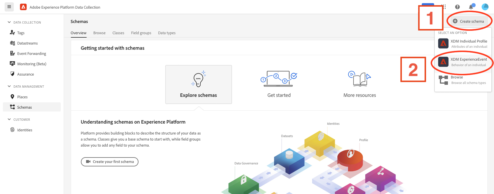
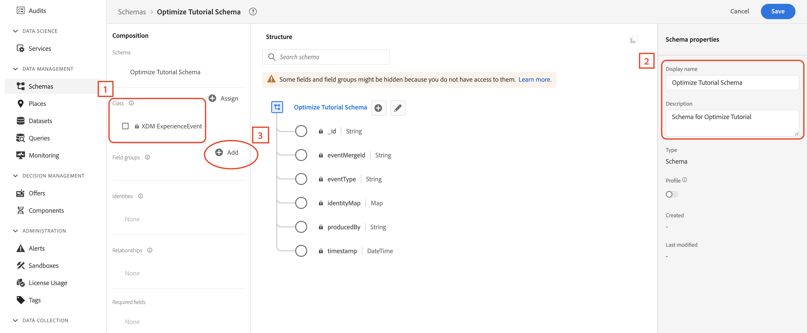
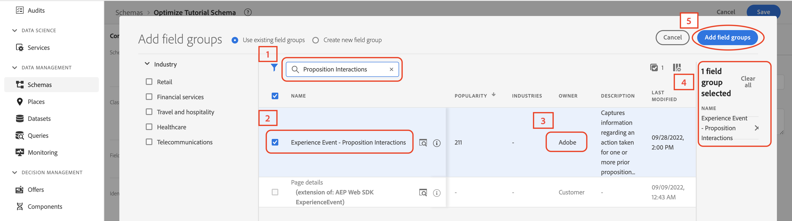
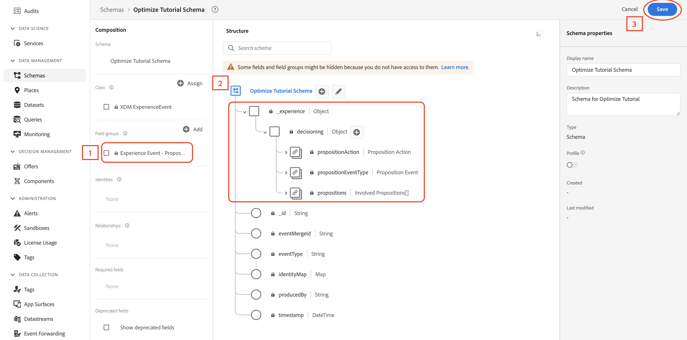

# Create a Schema
Before any app changes, some configuration items on the Adobe Experience Platform (AEP) side need to be set up. The end goal of this section is to create a mobile property that controls the configuration settings for the various AEP extensions used in this tutorial.

First, create an XDM schema (the format for data that the Edge Network uses) and configure a datastream (controls where the data will go). 
 
At a high level, a schema is a definition for the structure of your data; what properties you are expecting, what format they should be in, and checks for the actual values coming in.  

1. Go to the [Adobe Experience Platform](https://experience.adobe.com/#/platform), using your Adobe ID credentials to log in if prompted.

2. Navigate to the Data Collection UI by selecting the nine-dot menu in the top right (**1**), and selecting `Data Collection` (**2**)  

3. Select **Schemas** in the left navigation window  

4. In the schemas view, select the **+ Create schema** button (**1**) in the top right, then select `XDM ExperienceEvent` (**2**)

Once in the new schema creation view, notice the schema class is `XDM ExperienceEvent` (**1**); schemas adhere to specific class types which just means that they have some predefined properties and behaviors within the Edge platform. In this case, `XDM ExperienceEvent` creates the base properties you see in the `Structure` section that help define some baseline data for each Experience Event. 

5. Give the new schema a name and description (**2**) to help identify it.
6. Select the `+ Add` button (**3**) next to the `Field groups` section under `Composition`.

  
 What is a field group?

A schema is made up of building blocks called field groups.

Think of field groups as blueprints for specific groups of data; the data properties describing things like: the current device in use, products and contents/state of carts, information about the users themselves, etc. 

For example, the `Commerce Details` field group has properties for common commerce-related data like: 
- Product information (SKU, name, quantity)
- Cart state (abandons, product add sources, etc.). 
 
This logical grouping helps organize individual data properties into easily understandable sections. They are even reusable! Once you define a field group, you can use it in any schema that has a compatible class (some field groups only make sense with the capabilities of certain schema classes). There are two types of field groups available:

1. Adobe defined - standardized templates of common use-cases and datasets created and updated by Adobe
    - Note that Adobe Experience Platform services implicitly understand standard field groups and can provide additional functionality on top of just reading and writing data. That's why it is strongly recommended that you use standard field groups wherever possible.
2. Custom defined - any field group outside of the Adobe defined ones that users can use to create their own custom collections of data properties  

See the [Field Groups section in the Basics of schema composition](https://experienceleague.adobe.com/docs/experience-platform/xdm/schema/composition.html?lang=en#field-group) for an in depth look at how field groups work in the context of XDM schemas.

Add the following Adobe defined field group to the schema:  
- Experience Event - Proposition Interactions 

Use the search box (**1**) to look up the name (**2**) of the field group required for this section. Note the owner of the schemas should be **Adobe** (**3**).

Verify that all the required field groups are present in the right side info panel (**4**), then select **Add field groups** (**5**). 
  

Verify that the required field groups are present under the **Field groups** section (**1**) and the properties associated with those field groups are present under the **Structure** section (**2**), then select **Save** (**3**).

